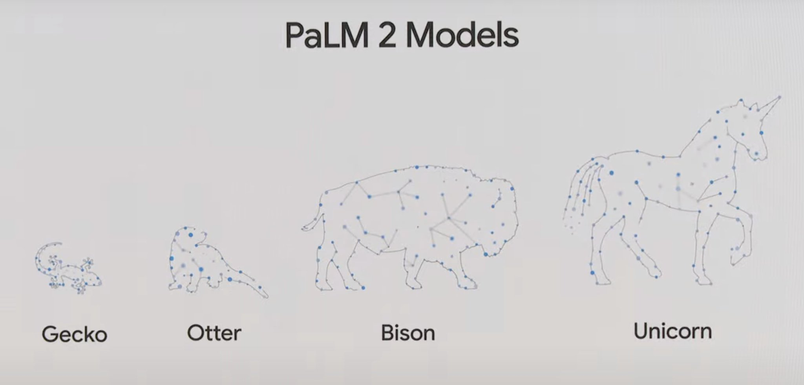
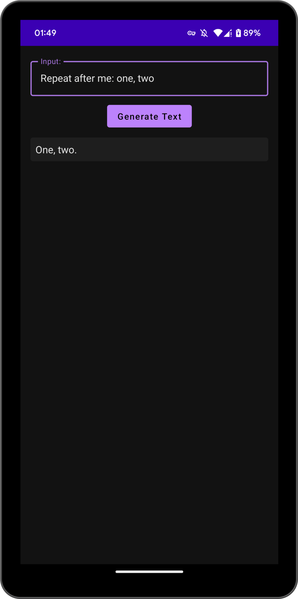
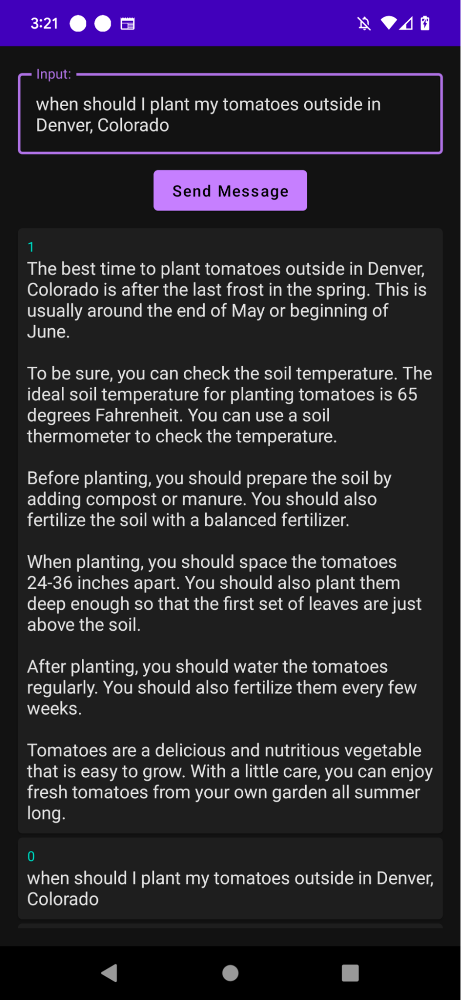
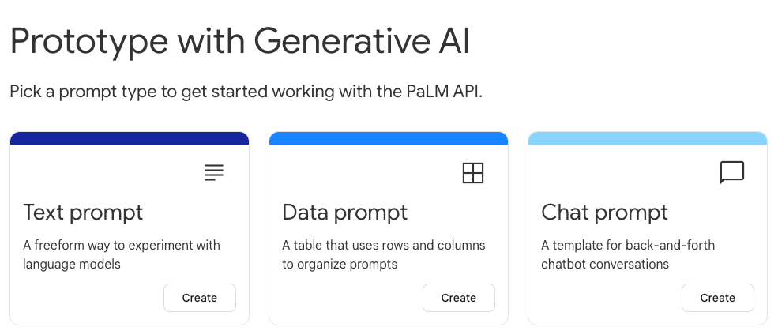
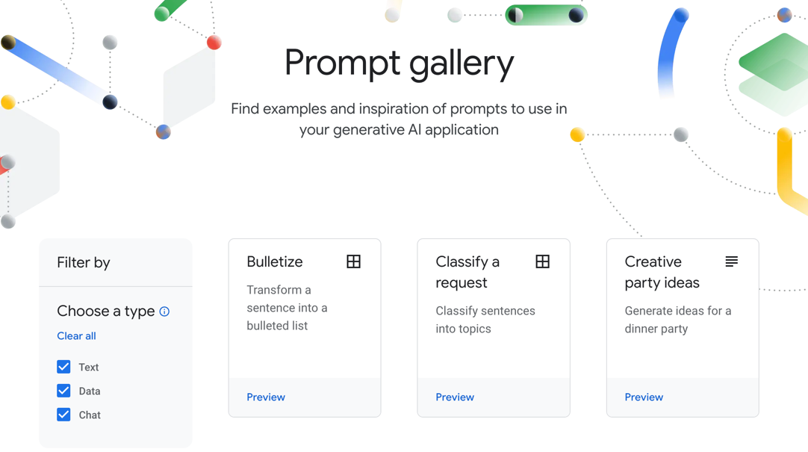

# PaLM2-Android

> 本文档主要介绍如何使用 Google PaLM2 API 以及 SDK 实现文本生成以及对话的功能，本项目中包含完整的 Android 示例代码。

## 1 简介

[Google I/O '23](https://www.youtube.com/watch?v=cNfINi5CNbY&ab_channel=Google) 大会上发布了一系列的 AI 产品，而这些产品背后的基础 AI 引擎就是 `PaLM2` 这个大语言模型了。

`PaLM2` 相比于其他的大语言模型不同的一点是，大语言模型在手机端运行的可能。其中 `PaLM2` 中最小的 `Gecko`（壁虎）模型可以直接运行在手机上。这对移动的开发者而言无疑是一个利好，同时对普通消费者而言也能更加方便快捷的使用到 AI 带来的各种能力。

下面我们详细介绍下 `PaLM2` 模型的一些情况。

## 2 模型介绍

`PaLM2` 根据模型大小分为了 4 版本，分别为：`Gecko`、`Otter`、`Bison`、`Unicorn`。



不过目前根据官方文档中 [模型介绍](https://developers.generativeai.google/models/language) 信息来看，公开的模型大小有 2 个，只支持了 `Gecko` 和 `Bison` 两个模型大小。

| Model size | Description         | 支持接口       |
|:-----------|:--------------------|:-----------|
| `Bison`    | PaLM API 最强大的模型。    | 对话、文本生成    |
| `Gecko`    | PaLM API 最小、最高效的模型。 | embeddings |

其中 `Bison` 模型又分了 `text-bison-001` 和 `chat-bison-001`，分别用于文本生成和对话。下面是各个模型的能力：

| 模型   | text-bison-001 | chat-bison-001 | embedding-gecko-001 |
|------|----------------|----------------|---------------------|
| 更新时间 | 2023.05        | 2023.05        | 2023.05             |
| 模型大小 | `Bison`        | `Bison`        | `Gecko`             |
| 能力   | 文本生成           | 对话             | 生成文本的词向量            |
| 请求限制 | 每分钟 30 个请求     | 每分钟 30 个请求     | 每分钟 300 个请求         |

目前官方文档中提供的仅有 `Bison` 和 `Gecko` 两个模型，其中可以离线运行在手机上的 `Gecko` 模型并不支持文本生成及对话的能力。


可以看出官方文档中的信息与 Google I/O '23 中的信息是还是有些出入的，想要让 `Gecko` 运行在手机本地应该还有一段路要走，当然也可能是文档还没有及时更新吧（🤔）。

下面我们就看一下如何使用 [Rest API](https://developers.generativeai.google/api) 以及 [SDK](https://developers.generativeai.google/tutorials/text_android_quickstart) 的方式实现文本生成以及对话的功能。

## 3 如何使用 PaLM2

### 3.1 简介

PaLM2 API 目前主要是提供了 3 种能力：

- **Text**：根据 Prompt 生成对应的文本，类似于 OpenAI 的 [Completions](https://platform.openai.com/docs/api-reference/completions) 接口；
- **Chat**：根据 Prompt 生成对应的回答，支持上下文，类似于 OpenAI 的 [Chat](https://platform.openai.com/docs/api-reference/chat) 接口；
- **Embedding**：计算文本词词向量的接口；

`PaLM2` 不像 OpenAI 只提供了官方的 Web API 和 Python SDK，它提供了官方各个语音的 SDK，包括 `Python`、`Node.js`、`Java`、`Android（Kotlin）`、`Swift`。

下面的主要介绍下云端 API 接口的定义以及 API 相关示例以 Android（Kotlin）为主进行展开。如果你了解过 OpenAI 相关的一些接口定义，那么你对下面的内容会比较熟悉。

> 注意，目前想要访问 PaLM2 相关的服务，需要先加入到 [waitlist](https://makersuite.google.com/waitlist) 等待审核通过。目前本人也没有访问权限，相关数据是种官方文档中整理。

### 3.2 REST API 

#### 3.2.1 文本生成：[Text](https://developers.generativeai.google/api/rest/generativelanguage/models/generateText)

针对 Prompt： “Write a story about a magic backpack.” 期望返回 2 条结果的请求的 Curl 如下：

```shell
curl https://generativelanguage.googleapis.com/v1beta2/models/text-bison-001:generateText?key=$PALM_API_KEY \
    -H 'Content-Type: application/json' \
    -X POST \
    -d '{
        "prompt": {
              "text": "Write a story about a magic backpack."
              },
        "temperature": 1.0,
        "candidate_count": 2}'
```

其中 `temperature` 表示返回文本的“随机”程度，取值在 0 和 1 之间。值越大随机性越高，如果是期望琪回答以一些固件的文本格式（如 JSON）时，应将 `temperature` 值调小。

返回结果如下：

```json
{
  "candidates": [
    {
      "output": "Once upon a time, there was a young girl named Lily...",
      "safetyRatings": [
        {
          "category": "HARM_CATEGORY_DEROGATORY",
          "probability": "NEGLIGIBLE"
        }, ...
      ]
    {
      "output": "Once upon a time, there was a young boy named Billy...",
      "safetyRatings": [
         ...
      ]
    }
  ]
}
```

其中 `output` 就是返回的文本结果。其中和 OpenAI 接口不同的是 PaLM 提供了生成文本的安全相关的信息，这个可以应该解决 LLM “胡说八道”的一些问题。其中 [category](https://developers.generativeai.google/api/rest/generativelanguage/models/generateText#harmcategory) 和 [probability](https://developers.generativeai.google/api/rest/generativelanguage/models/generateText#harmblockthreshold) 是两个枚举，分别控制返回内容的安全信息（比如黄赌毒信息）以及对应信息过滤的阈值。

#### 3.2.2 生成对话：[Chat](https://developers.generativeai.google/api/rest/generativelanguage/models/generateMessage)

比如开始一个 Hi 的对话的 Curl 如下，prompt ：

```shell
curl https://autopush-generativelanguage.sandbox.googleapis.com/v1beta2/models/chat-bison-001:generateMessage?key=$PALM_API_KEY  \
  -H 'Content-Type: application/json' \
  -X POST \
  -d '{
      "prompt": {"messages": [{"content":"hi"}]}, 
      "temperature": 0.1, 
      "candidate_count": 1}'
```

这里的 prompt 是一个列表，上下文的信息就是需要通过此列表来传输。返回 JSON 内容如下：

```json
{
  "candidates": [
    {
      "author": "1",
      "content": "Hi there! How can I help you today?"
    }
  ],
  "messages": [
    {
      "author": "0",
      "content": "hi"
    }
  ]
}
```

`candidates` 表示的就是返回的回答内容，请求中设置的 `candidate_count` 为 1，所以这里只返回一条内容。`messages` 字段中的内容就是请求中的历史对话信息。请求和返回中都有这部分信息不知道是否是冗余的，除此之外这里应该不会多次计算 Token。

这些需要注意的一点是 `author` 这个字段，这个有点类似 OpenAI 接口中的 [role](https://platform.openai.com/docs/api-reference/chat/create#chat/create-role) 这个字段。不同的是 OpenAI 是一个枚举，包含 `system`, `user`, or `assistant` 三个内容；而 `PaLM2` 中的 [author](https://developers.generativeai.google/api/rest/generativelanguage/Message) 则是一个可选值，任意的一个字符串都可以，可能是为了后面的群聊设计的（？）。这里还没有看到如何给当前这次对话设置一个角色，或者是给当前的对话设置一个上下文。

#### 3.2.3 其他接口

除了上述的两个主要接口外，还有 [计算 Token 数](https://developers.generativeai.google/api/rest/generativelanguage/models/countMessageTokens)、[获取模型列表](https://developers.generativeai.google/api/rest/generativelanguage/models/list)、[查看模型详情](https://developers.generativeai.google/api/rest/generativelanguage/models/get)、生成 [文本 Embedding](https://developers.generativeai.google/api/rest/generativelanguage/models/embedText) 等接口，这里就不详细展开了，感兴趣的可以点击链接查看。

### 3.3 Android SDK

上述的 API 接口并不负责，但是一步步编写对于的解析逻辑还是需要一定的工作量的，还好目前官方已经提供了 SDK ，我们下面看一下 Android 中如果使用。

#### 3.3.1 [Text](https://developers.generativeai.google/tutorials/text_android_quickstart)

##### 3.3.1.1 初始化 Client

```kotlin
private fun initializeTextServiceClient(
    apiKey: String
): TextServiceClient {
    // (This is a workaround because GAPIC java libraries don't yet support API key auth)
    val transportChannelProvider = InstantiatingGrpcChannelProvider.newBuilder()
        .setHeaderProvider(FixedHeaderProvider.create(hashMapOf("x-goog-api-key" to apiKey)
        .build()

    // Create TextServiceSettings
    val settings = TextServiceSettings.newBuilder()
        .setTransportChannelProvider(transportChannelProvider)
        .setCredentialsProvider(FixedCredentialsProvider.create(null))
        .build()

    // Initialize a TextServiceClient
    val textServiceClient = TextServiceClient.create(settings)

    return textServiceClient
}

```

##### 3.3.1.2 创建 Prompt

```kotlin
private fun createPrompt(
    textContent: String
): TextPrompt {
    val textPrompt = TextPrompt.newBuilder()
        .setText(textContent)
        .build()

    return textPrompt
}

```

##### 3.3.1.3 创建 Request

```kotlin
private fun createTextRequest(prompt: TextPrompt): GenerateTextRequest {
    return GenerateTextRequest.newBuilder()
        .setModel("models/chat-bison-001") // Required, which model to use to generate the result
        .setPrompt(prompt) // Required
        .setTemperature(0.5f) // Optional, controls the randomness of the output
        .setCandidateCount(1) // Optional, the number of generated texts to return
        .build()
}
```

##### 3.3.1.4 发送请求

```kotlin
private fun generateText(
    request: GenerateTextRequest
) {
    viewModelScope.launch(Dispatchers.IO) {
        try {
            val response = client.generateText(request)
            val returnedText = response.candidatesList.last()
            // display the returned text in the UI
        } catch (e: Exception) {
            // There was an error
        }
    }
}
```

#### 3.3.2 Chat

##### 3.3.2.1 初始化 Client

```kotlin
private fun initializeDiscussServiceClient(
    apiKey: String
): DiscussServiceClient {
    // (This is a workaround because GAPIC java libraries don't yet support API key auth)
    val transportChannelProvider = InstantiatingGrpcChannelProvider.newBuilder()
        .setHeaderProvider(FixedHeaderProvider.create(hashMapOf("x-goog-api-key" to apiKey)))
        .build()

    // Create DiscussServiceSettings
    val settings = DiscussServiceSettings.newBuilder()
        .setTransportChannelProvider(transportChannelProvider)
        .setCredentialsProvider(FixedCredentialsProvider.create(null))
        .build()

    // Initialize a DiscussServiceClient
    val discussServiceClient = DiscussServiceClient.create(settings)

    return discussServiceClient
}
```

##### 3.3.2.2 创建 Prompt

```kotlin
private fun createPrompt(
    messageContent: String
): MessagePrompt {
    val palmMessage = Message.newBuilder()
        .setAuthor("0")
        .setContent(messageContent)
        .build()

    val messagePrompt = MessagePrompt.newBuilder()
        .addMessages(palmMessage) // required
        .setContext("Respond to all questions with a rhyming poem.") // optional
        .addExamples(createCaliforniaExample()) // use addAllExamples() to add a list of examples
        .build()

    return messagePrompt
}
```

##### 3.3.2.3 创建 Request

```kotlin
private fun createMessageRequest(prompt: MessagePrompt): GenerateMessageRequest {
    return GenerateMessageRequest.newBuilder()
        .setModel("models/chat-bison-001") // Required, which model to use to generate the result
        .setPrompt(prompt) // Required
        .setTemperature(0.5f) // Optional, controls the randomness of the output
        .setCandidateCount(1) // Optional, the number of generated messages to return
        .build()
}
```

##### 3.3.2.4 发送请求

```kotlin
private fun generateMessage(
        request: GenerateMessageRequest
) {
    viewModelScope.launch(Dispatchers.IO) {
        try {
            val response = client.generateMessage(request)
            val returnedMessage = response.candidatesList.last()
            // display the returned message in the UI
        } catch (e: Exception) {
            // API returned an error
        }
    }
}
```

##### 3.3.2.5 多轮对话

```kotlin
fun sendMessage(userInput: String) {
    val prompt = createPrompt(userInput)
    val request = createMessageRequest(prompt)
    generateMessage(request)
}
```

#### 3.3.3 其他 API

除了上述的生成文本以及对话的 API 之外，官方文档中还提供了 [Embedding](https://developers.generativeai.google/tutorials/embed_java_quickstart) 的接口，这里就不详细展开了。文档中没有写的 API（如获取模型列表、获取模型详情）其实通过查看源码也能发现 SDK 中也已经提供对应的能力了。

### 3.4 示例

项目完整的项目示例可以到官方项目 [generative-ai-docs](https://github.com/google/generative-ai-docs) 中进行查看，目前可以的示例基本都是 WEB 相关的。

其中也提供了 iOS Swift 版本的示例：[generative-ai-swift](https://github.com/google/generative-ai-swift) ，目前官方并没有提供 Android 的完整示例，只有上述的一些代码片段。我这边自己整理了一个 Android 的示例工程。效果大致如下：

| Text               | Chat               |
|:-------------------|:-------------------|
|  |  |

## 4 图形化工具：MakerSuite

无论是 Text 还是 Chat，输入的 Prompt 对结果的影响会很大，有时候想要达到我们期望的效果需要调试很长一段时间，如果仅仅是通过代码的方式进行调试会有一些局限性。针对这种情况，Google 也提供了一个图形化的工具：[MakerSuite](https://developers.generativeai.google/tutorials/makersuite_quickstart) 来解决这个问题。

MakerSuite 这个工具类似于 OpenAI 的 playground，从介绍来看完成度会更高，交互会更友好些。MakerSuite 主要有 3 个使用场景：



1. [Text prompts](https://developers.generativeai.google/tutorials/makersuite_quickstart#text_example)：针对 Text 接口的调试页面；
2. [Chat prompts](https://developers.generativeai.google/tutorials/makersuite_quickstart#chat_example)：针对 Chat 接口的调试页面，这里会回一些上下文以及角色的定义，可以通过此方式查看官方是如何定义 `author` 这个属性的；
3. [Data prompts](https://developers.generativeai.google/tutorials/makersuite_quickstart#data_example)：这是专门针对少样本学习这种场景的页面，这里和上述两个不同的是可以上传一些表格类型的文本数据进行调试；

上述 3 个场景中包含一些基本的操作，比如设置请求的具体参数信息（如设置模型/随机性等）、将调试的内容直接复制为各个平台的代码。

除了上述内容之外，官方也提供了一个 [Prompt Gallery](https://developers.generativeai.google/prompt-gallery) 功能，展示了各种场景的 Prompt，相当于官方给出的各个场景中的最佳实践了。



## 5 [常见问题](https://developers.generativeai.google/guide/preview_faq)

**预览期将持续多长时间？**

我们目前的估计是预览期将在 2023 年下半年结束。

**PaLM** **API** **的定价是多少？**

在预览期间，开发者可以免费试用 PaLM API。定价将在临近全面上市时公布。

**公共预览版在哪里可用？**

PaLM API 公共预览版目前仅在美国可用。我们正在努力尽快开放对其他地区的访问。

## 6 写在最后

### 6.1 小结

本文主要是根据官方文档介绍了使用 Web API 以及 Android SDK 访问 PaLM2 的大致流程。具体内容大致如下：

1. 到目前为止，`PaLM2` 中是有两个模型（`Gecko`、`Bison`）大小可供使用。其中可用于移动端的 `Gecko` 模型仅支持 `Embedding` 能力，没有看到对话相关的介绍；
2. PaLM2 除了提供了基本的云端接口外，还提供了 `Python`、`Node.js`、`Java`、`Android`（`Kotlin`）以及 `Swift` 的 SDK，相比于 OpenAI 只提供了 Python 库相比更有诚意；
3. `PaLM2` 提供的接口能力与 OpenAI 基本一致，但是完成度会差不少，感觉设计上会有更多的考虑（比如隐私安全相关的 API 设置），便于后期扩展；
4. 目前 `PaLM2` 还处于预览阶段，需要加入 waitlist 并审核通过后才能体验；

更多详细内容可以官网中进一步查看：[PaLM API | Generative AI for Developers](https://developers.generativeai.google/)

### 6.2 个人思考

其实，关于 `PaLM2` 最吸引我的地方还是在与其可以离线部署在手机端运行，从目前的调研结果来看，想要拿到 SDK 尝试其真实的效果应该还要等一点时间。

为什么 PaLM2 在手机端本地运行那么重要？或者说对于 Google 是一个重点方向。个人拙见，从以下几个方面阐述：

1. Google 相比于其他的 LLM 竞争者，Android 操作系统是 Google 的“护城河”，其他参与者无法快速在操作系统层面有深度的整合。当然，微软也可能会在 PC 市场上也尝试从方式，但是 PC 的出货量和手机还是有些差距的。
2. 围绕 Android 系统的上下游的厂商也肯定不像错过这一场 AGI 的浪潮，肯定也想做些事情，那么在 Android 手机运行自己的大语言模型是一个不错的思路。
3. 近些年，[安迪-比尔定律](https://zh.wikipedia.org/zh-hans/%E5%AE%89%E8%BF%AA-%E6%AF%94%E7%88%BE%E5%AE%9A%E5%BE%8B#:~:text=%E5%AE%89%E8%BF%AA-%E6%AF%94%E5%B0%94%E5%AE%9A%E5%BE%8B) 在手机上的逐渐失效，手机硬件的升级已经不被消费者过度追求。除了现在手机的硬件已经足够快之外，另外就是没有新的超级 App 把这些新升级的硬件性能消耗掉，所以整体上人们换机的意愿比较低。

对消费者而言也是有好处的，使用自己的个人数据“训练”一个自己的智能助理，而且这个助理可以仅仅只存在自己的手机上。除了老生常谈的隐私安全方面考虑外，就是大语言模型可以充分理解手机中的上下文，而不是在每个应用/模型中分别多次的输入上下信息。

以上是自己的个人拙见，目前看在手机端离线运行大语言模型还有一些挑战和不确定性，但是不管怎样，我们现在只有积极拥抱**不确定性**，才可能在未来拥有更多的**确定性**。
